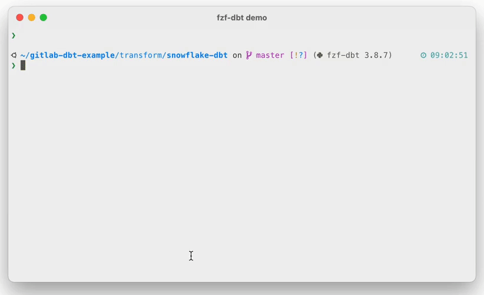
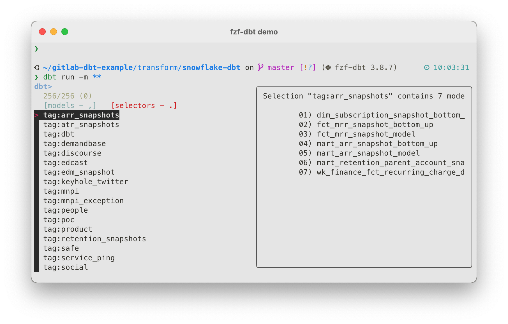
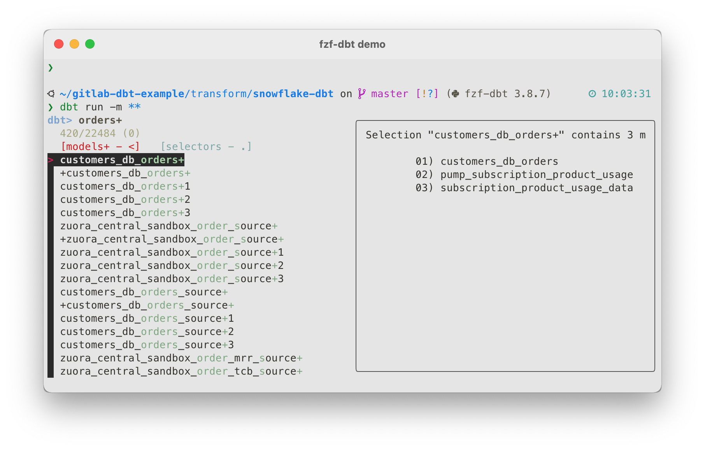

# fzf-dbt - An interactive search for dbt models

Adds interactive model search and selection to dbt-cli.

Instead of having to remember your model names, you can simply type `dbt run -m **<TAB>` and an interactive search will appear.

It works by integrating the command line fuzzy finder [fzf](https://github.com/junegunn/fzf) with [dbt](https://github.com/dbt-labs/dbt-core).

1. [Demo](#demo)
    1. [Interactive search and model selection](#interactive-search-and-model-selection)
    2. [Model code preview](#model-code-preview)
    3. [Tag and package selection](#tag-and-package-selection)
    4. [Selection modifiers `+` and `@` are also supported](#selection-modifiers--and--are-also-supported)
2. [Installation](#installation)
    1. [Install fzf](#install-fzf)
    2. [Install other dependencies](#install-other-dependencies)
    3. [Install fzf-dbt](#install-fzf-dbt)
3. [Usage](#usage)
4. [Configuration](#configuration)
    1. [Preview command](#preview-command)
    2. [Window Height](#window-height)
5. [Limitations](#limitations)
6. [Related Projects](#related-projects)

## Demo



### Interactive search and model selection

You can narrow down the available models by typing. The search is "fuzzy". So if you want to select the model `netsuite_customers_source`, you can simply type `custso` and it will appear as the top match.

You can select the model by pressing `enter` and it will be added to your command line. Alternatively, you can also press `tab` or `shift-tab` to select multiple models at once.

### Model code preview

While browsing the models, you can also see a preview of the model code on the right. You can even use [bat](https://github.com/sharkdp/bat) to get code syntax highlighting.

The preview content can also be scrolled with your trackpad or mouse wheel.

### Tag and package selection



In the default view fzf-dbt shows you all your dbt models. But you can also press `.` to switch to the tag and package selection view.

While in the tag and package selection view, the preview will show you all the models that would be included with the tag or package.

To switch back to the model view, press `,`.

### Selection modifiers `+` and `@` are also supported

Simply press `<` (`shift and ,`) to switch to the advanced model selection view that contains all models including modifiers, such as `2+stg_orders`.

You can switch back to the other views by pressing `,` or `.`.



## Installation

Please keep in mind that currently fzf-dbt only work with zsh. So if you are using bash, you'll need to switch to zsh.

### Install fzf

First you need to install [fzf](https://github.com/junegunn/fzf) itself.

```shell
# Download the fzf source
git clone --depth 1 https://github.com/junegunn/fzf.git ~/.fzf

# Run the fzf install script
~/.fzf/install --key-bindings --completion --update-rc
```

Then simply open a new shell in a new terminal window or tab.

You can test whether fzf was installed successfully by typing `ssh **<TAB>`. An fzf shell with a list of previously connected SSH hosts should appear.

You are good to go if fzf appears. If not, [please consult fzf's own documentation here](https://github.com/junegunn/fzf).

### Install other dependencies

You will also need to install the command line JSON processor [jq](https://stedolan.github.io/jq/). It's used to parse dbt's manifest json.

```shell
# macOS
brew install jq

# Ubuntu and debian
sudo apt-get install jq
```

For other systems, please consult the [jq's documentation](https://stedolan.github.io/jq/download/).

Optionally, you can also install [bat](https://github.com/sharkdp/bat), which is a `cat` clone that supports code syntax highlighting.

```shell
# macOS
brew install bat

# Ubuntu and debian
# Download and install the deb file from https://github.com/sharkdp/bat/releases
```

### Install fzf-dbt

```shell

# Copy and paste the following command to add fzf-dbt to your `.zshrc`

cat <<EOF >> ~/.zshrc
FZF_DBT_PATH=~/.fzf-dbt/fzf-dbt.sh
if [[ ! -f $FZF_DBT_PATH ]]; then
    FZF_DBT_DIR=$(dirname $FZF_DBT_PATH)
    print -P "%F{green}Installing fzf-dbt into $FZF_DBT_DIR%f"
    mkdir -p $FZF_DBT_DIR
    command curl -L https://raw.githubusercontent.com/Infused-Insight/fzf-dbt/main/src/fzf_dbt.sh > $FZF_DBT_PATH && \
        print -P "%F{green}Installation successful.%f" || \
        print -P "%F{red}The download has failed.%f"
fi

export FZF_DBT_PREVIEW_CMD="cat {}"
export FZF_DBT_HEIGHT=80%
source $FZF_DBT_PATH
EOF
```

After that simply start a new shell in your terminal. Zsh will download and activate fzf-dbt.

## Usage

**Activation**

You can activate fzf-dbt by typing `**<TAB>` while entering a dbt command, such as `dbt run -m **<TAB>`.

It's also not limited to the `-m` parameter and works everywhere like `--select`, `--exclude` and so on.

**Search**

To search, simply start typing and fzf will show you the models that match your input.

**Model Selection**

To select a single model, navigate to it with the `up`/`down` keyboard keys and press `enter`.

Alternatively, you can also use `tab` or `shift+tab` to select multiple models before sending all of them to the command line with `enter`.

**View switching**

In addition to that, you can also switch different views by pressing `,`, `.` and `<`. This allows you to select tags, package paths and models with `+` and `@` modifiers.

Please refer to the [demo section](#demo) above for more information and a demo video.

## Configuration

### Preview command

You can adjust the command that is used to show a preview of the dbt models.

To do this, simply set the `FZF_DBT_PREVIEW_CMD` environment variable. The `{}` placeholder will be replaced with the file path of the model.

It's recommended to use [bat](https://github.com/sharkdp/bat), which is a `cat` clone that supports code syntax highlighting.

Edit your `.zshrc` and adjust the `FZF_DBT_PREVIEW_CMD` variable to something like...

```shell
export FZF_DBT_PREVIEW_CMD='bat --theme OneHalfLight --color=always --style=numbers {}'
```

### Window Height

You can also adjust the height of the window. By default, it is 80% of your terminal window's height.

But you can adjust it with...

```shell
export FZF_DBT_HEIGHT=40%

```

## Limitations

In order to be fast, fzf-dbt parses dbt's `manifest.json` file. But this file is only updated when you run the `compile`, `run`, `test` or another dbt command that compiles the project.

Therefore if you add a models, but don't run any of these commands, fzf-dbt won't be able to find those models.

## Related Projects

* [dbt-completion](https://github.com/dbt-labs/dbt-completion.bash)
  * Bash and zsh tab-completion scripts.
  * In addition to allowing you to tab through the models, they also provide completions for all other parameters.
  * So you can for example type `dbt run --<TAB><TAB>` and see which other options the `run` command supports.
* [fzf-tab](https://github.com/Aloxaf/fzf-tab)
  * Forwards all your shell completions into fzf.
  * Amazing when combined with dbt-completions.
  * You can type `dbt run --<TAB><TAB>`, fzf will appear and you can interactivly search for the option you want to add to your command.
